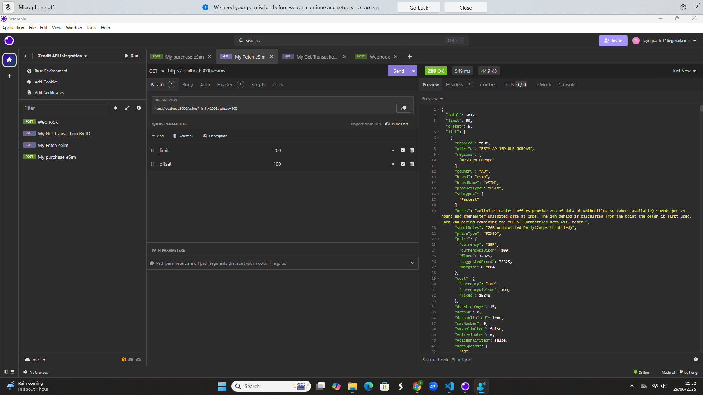
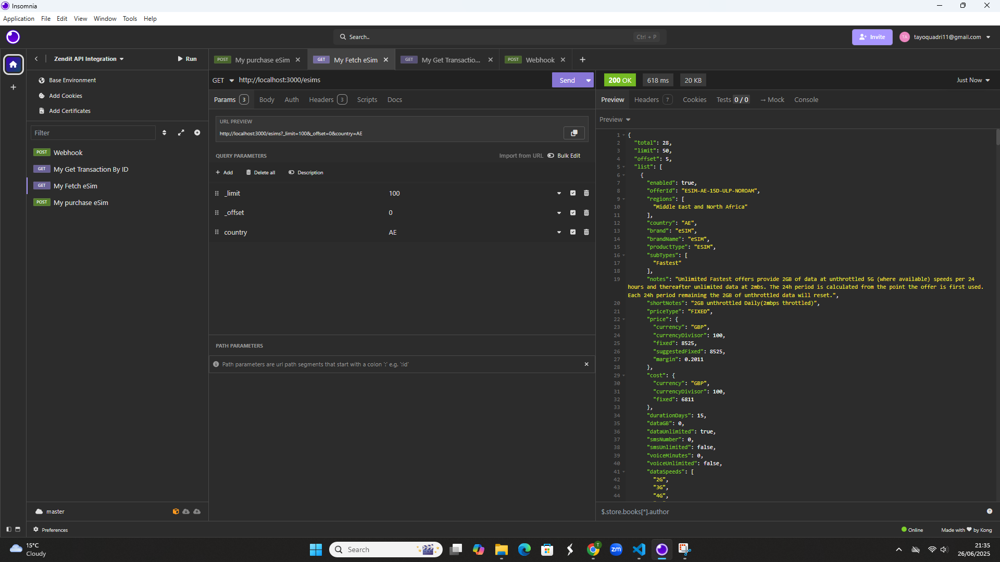
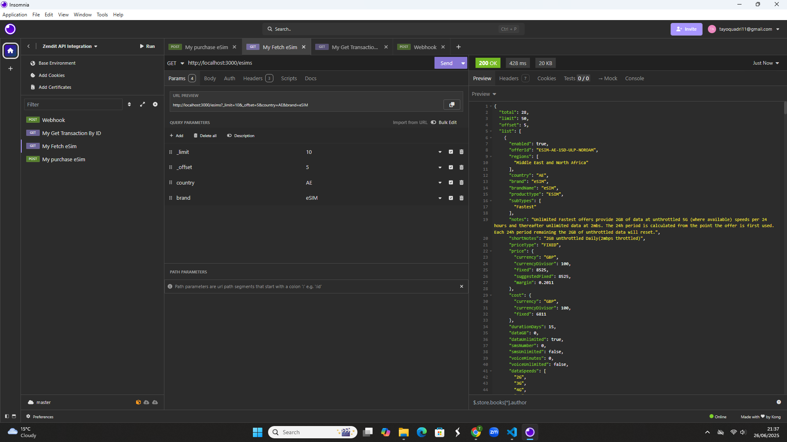

🔐 **Environment Variables**

ZENDIT_API_KEY=`your_sandbox_api_key_here`

ZENDIT_BASE_URL="https://api.zendit.io/v1/esim"

PORT=3000

📥 Task 1: Fetch Available eSIMs

✅ **Goal**
This endpoint fetches a list of available eSIMs from Zendit's sandbox API. It supports required pagination controls (\_limit, \_offset) and optional filtering by country and brand (network type).

🔧 **Endpoint**
GET /esims

📌 **Query Parameters**

| Parameter | Required | Default | Description                                                |
| --------- | -------- | ------- | ---------------------------------------------------------- |
| `_limit`  | ✅ Yes   | 0       | Number of results per request                              |
| `_offset` | ✅ Yes   | 0       | Starting point for pagination                              |
| `country` | ❌ No    | ""      | Filter results by ISO country code (e.g., `AD` `US` `AE` ) |
| `brand`   | ❌ No    | ""      | Filter by brand/network (e.g., `eSIM`)                     |

If country and/or brand are provided, they are included as filters in the request. If not provided, the API will return results across all regions and brands.

⚙️ **Behavior & Defaults**

If no query parameters are provided, default values are automatically applied:

req.query.limit || 0;

req.query.offset || 0;

🧪 **Example Requests (Insomnia)**
✅ Get all eSIMs (default pagination)
GET /esims

✅ Custom pagination
GET /esims?_limit=200&_offset=100

✅ Filter by country
GET /esims?_limit=100&_offset=0&country=AE

✅ Filter by brand
GET /esims?limit=200&offset=5&brand=eSIM

✅ Filter by country & brand
GET /esims?limit=10&offset=5&country=AE&brand=eSIM

===============================================================================================================
================================================================================================================

📥 Task 2: Purchase an eSIM
✅ **Goal**
Create a POST /buy-esim endpoint that allows users to initiate an eSIM purchase via the Zendit API.

| Field           | Type   | Required | Description                                             |
| --------------- | ------ | -------- | ------------------------------------------------------- |
| `offerId`       | string | ✅ Yes   | The **catalog ID** of the eSIM to be purchased          |
| `transactionId` | string | ✅ Yes   | Unique ID generated by our system to track the purchase |

NOTE
Instead of product_id (mentioned in the Task), Zendit actually expects:
offerId (a.k.a product ID)
transactionId (a unique string you generate)

🧪**Example Request (Insomnia)**
POST /buy-esim
{
"offerId": "ESIM-AD-15D-UNLIMITED-NOROAM",
"transactionId":"2307ehsKEKGLE"
}

