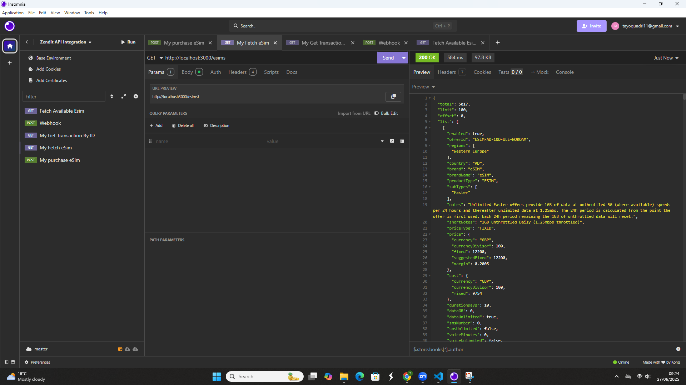
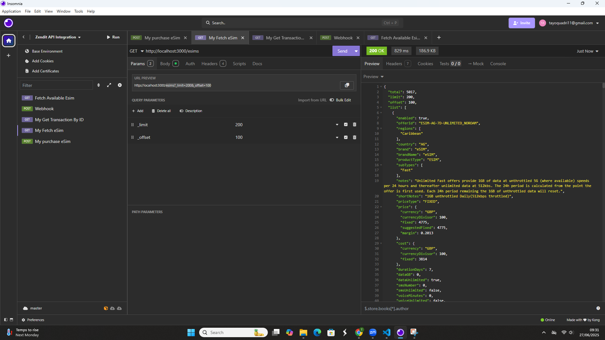
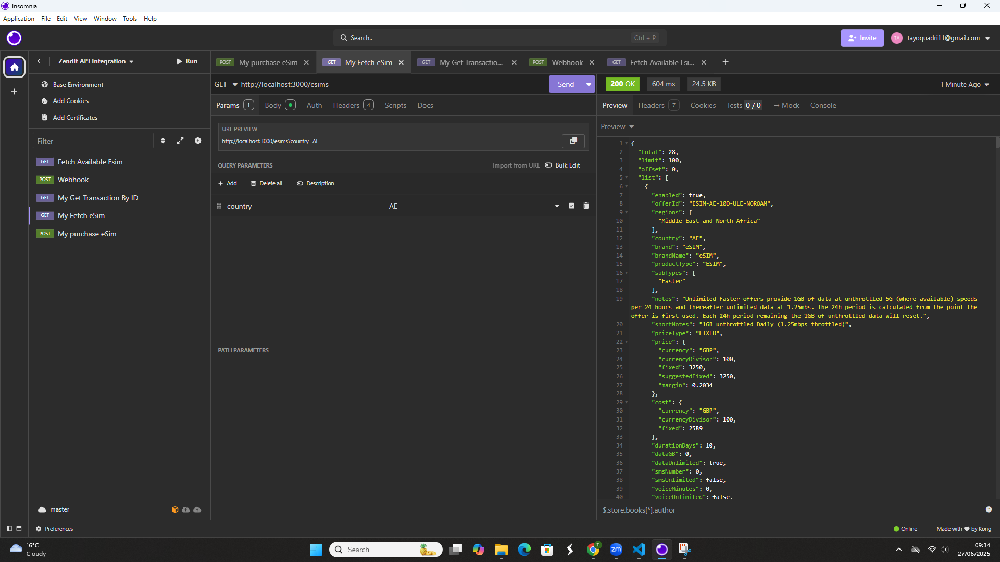
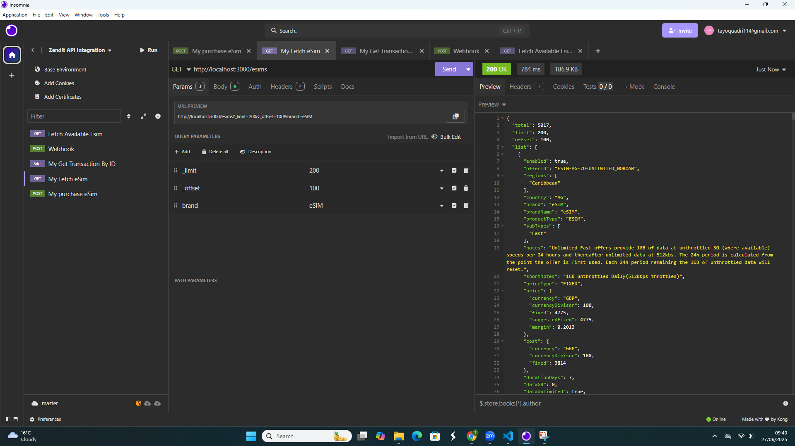
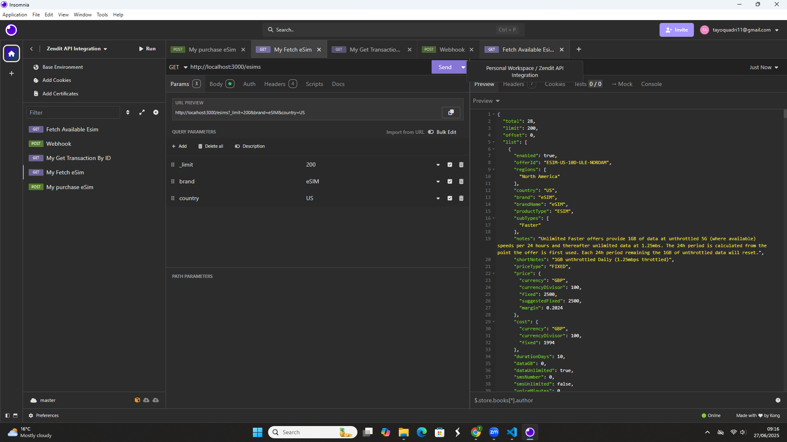
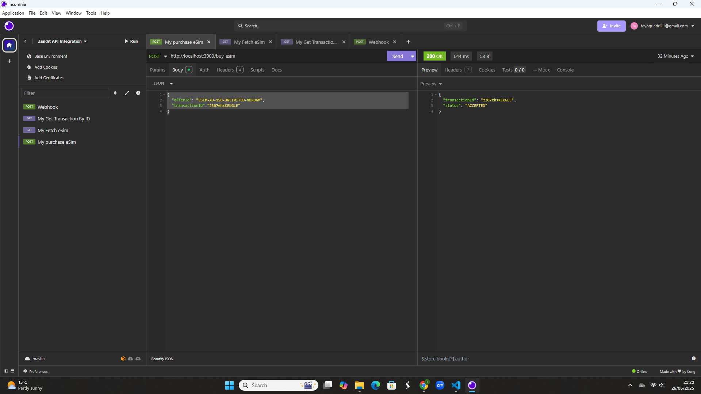
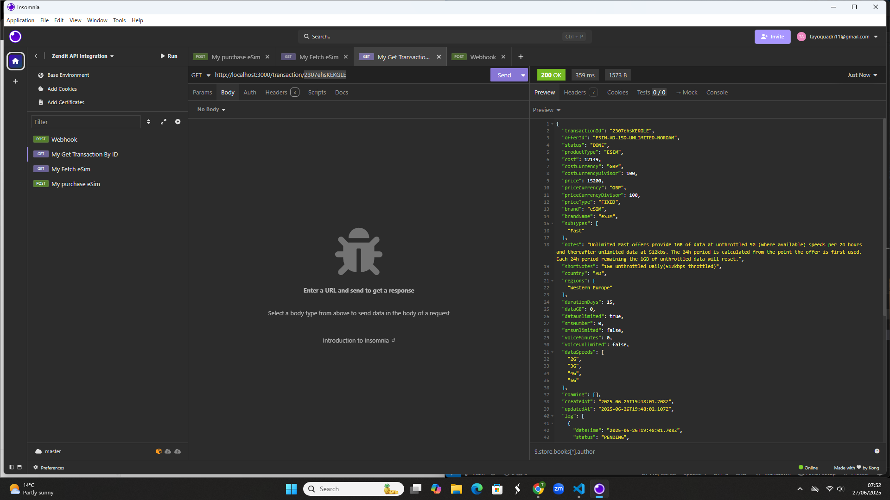
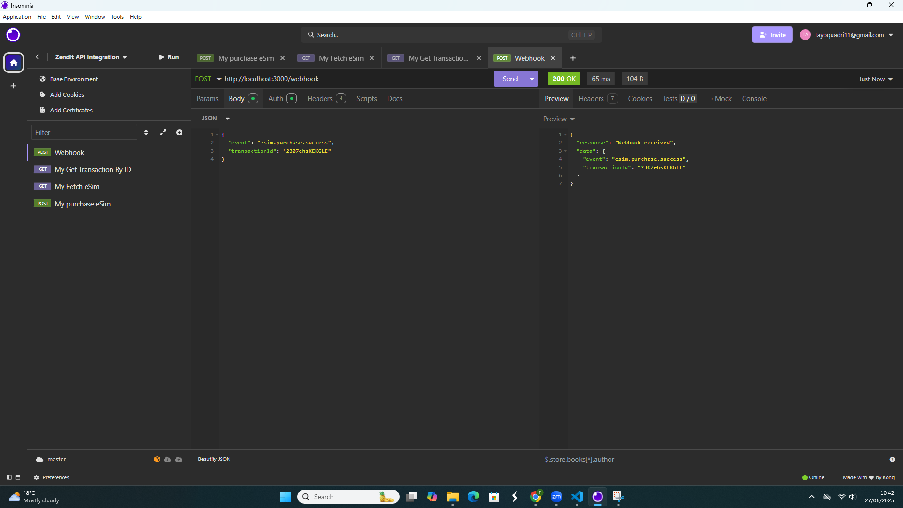

✅ Requirements to RUN This Project
1. Install Node.js (`npm -v`)
2. Install Project Dependecies (`npm install`)
3. Create `.env` file (Use the .env.example as a template:)
4. Run the Server (`npm start`)

🔐 **Environment Variables**

ZENDIT_API_KEY=`your_sandbox_api_key_here`

WEBHOOK_SECRET=`your-webhook-token-here`

ZENDIT_BASE_URL="https://api.zendit.io/v1/esim"

PORT=3000

1. 📥 Task 1: Fetch Available eSIMs

✅ **Goal**
This endpoint fetches a list of available eSIMs from Zendit's sandbox API. It supports required pagination controls (\_limit, \_offset) and optional filtering by country and brand (network type).

🧾 **Endpoint**
GET `/esims`

📌 **Query Parameters**

| Parameter | Required | Default | Description                                                |
| --------- | -------- | ------- | ---------------------------------------------------------- |
| `_limit`  | ✅ Yes   | 0       | Number of results per request                              |
| `_offset` | ✅ Yes   | 0       | Starting point for pagination                              |
| `country` | ❌ No    | ""      | Filter results by ISO country code (e.g., `AD` `US` `AE` ) |
| `brand`   | ❌ No    | ""      | Filter by brand/network (e.g., `eSIM`)                     |

🔎 **Filtering Behavior**

- The `country` and `brand` query parameters are optional filters.
- If both are provided, they will be used to narrow down the results.
- If neither is provided, the API will return results across all regions and brands; but only if valid `_limit` and `_offset` values are set.
- If `_limit = 0` and `_offset = 0` are used (as provided by default in the Zendit documentaion), Zendit will return an empty `list`, even though total may show thousands of results. e.g
- `
 {
  "total": 5017,
  "limit": 0,
  "offset": 0,
  "list": []
} `

🧠 **Recommended Defaults (Used in This Project)**

If no query parameters are provided, default values are automatically applied:

req.query._limit || 100;

req.query._offset || 0;

🧪 `Example Request (INSOMNIA)`

✅ Get all eSIMs (default pagination)
GET `/esims`

✅ Custom pagination

**Query Parameters:**

- _limit=200
- _offset=100

✅ Filter by country

**Query Parameters:**

- country=AE

✅ Filter by brand

**Query Parameters:**

- _limit=200
- _offset=100
- brand=eSIM

✅ Filter by country & brand

**Query Parameters:**

- _limit=200
- brand=eSIM
- country US

---

1. 📥 Task 2: Purchase an eSIM

✅ **Goal**

Create a POST `/buy-esim` endpoint that allows users to initiate an `eSIM` purchase via the Zendit API.

| Field           | Type   | Required | Description                                             |
| --------------- | ------ | -------- | ------------------------------------------------------- |
| `offerId`       | string | ✅ Yes   | The **catalog ID** of the eSIM to be purchased          |
| `transactionId` | string | ✅ Yes   | Unique ID generated by our system to track the purchase |

NOTE

Instead of product_id (mentioned in the Task), Zendit actually expects:

offerId (a.k.a product ID)

transactionId (a unique string you generate)

💻 `Example Request (INSOMNIA)`

POST /buy-esim

{
"offerId": "ESIM-AD-15D-UNLIMITED-NOROAM",
"transactionId":"2307ehsKEKGLE"
}

---

3. 🔍 Task 3: Get Transaction by ID

✅**Goal**
This endpoint allows retrieval of detailed information about a previously made eSIM purchase using the unique `transactionId` generated during that purchase request.

🧾 Endpoint
GET `/transaction/:id`

🧠 How It Works
- `:id` in the URL path is the `transactionId`. This is the transactionId one our system generated when purchasing an eSIM.
- The controller extracts this ID from the route, calls the Zendit API, and returns the full transaction response.

📥 Path Parameter

| Parameter | Type   | Required | Description                                            |
| --------- | ------ | -------- | ------------------------------------------------------ |
| `id`      | string | ✅ Yes    | Your own system’s `transactionId` used during purchase |

💻 `Example Request (INSOMNIA)`

GET `/transaction/2307ehsKEKGLE`

---

4. 🔐Task 4: Webhook Signature Verification
   
✅ **Goal**
This endpoint receives webhook events from Zendit (e.g., purchase status updates) and verifies their authenticity using a shared secret configured via the Zendit sandbox webhook registration page.

🧾 Endpoint
` /webhook`

🔐 **Authentication & Signature Verificatio**

When registering your webhook in the Zendit sandbox, you defined a custom HTTP header:

- Header KEY: Authorization
- Header Value: Bearer <webhook-secret-token>
- This should also be secret token stored in your .env file as: `WEBHOOK_SECRET=your-webhook-secret-token`

💻 `Example Request ( Verify Signature through INSOMNIA)`

POST `/webhook`

{
  "event": "esim.purchase.success",
  "transactionId": "2307ehsKEKGLE",
}

